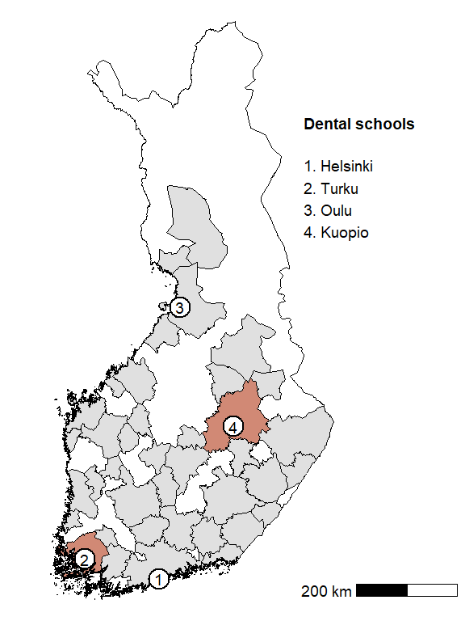
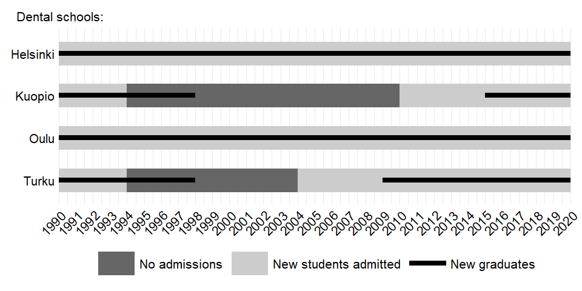
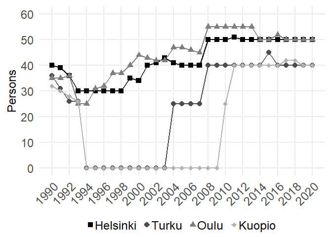

# The Effects of Supply on Medical Labor Markets
Mikko Herzig, Konsta Lavaste, Allan Seuri
March 11, 2026

## Preliminaries

First, let’s load the setup and functions into memory.

<details open class="code-fold">
<summary>Code</summary>

``` r
# Load knitr
  library(knitr)

# Load here package for relative file paths
  library(here)

# Run setup script
  source(here("scripts", "00_setup.R"))

# Load functions
  source(here("scripts", "00_functions.R"))
```

</details>

## Map

In this section we create map of Finland which includes:

1.  locations of dental schools
2.  commuting zones

<!-- -->

    Requesting response from: http://geo.stat.fi/geoserver/wfs?service=WFS&version=1.0.0&request=getFeature&typename=tilastointialueet%3Akunta1000k_2013

    Warning: Coercing CRS to epsg:3067 (ETRS89 / TM35FIN)

    Data is licensed under: Attribution 4.0 International (CC BY 4.0)

    Passing 4 addresses to the Nominatim single address geocoder

    Query completed in: 4.2 seconds



## Timeline

In this section, we draw a graph which depicts the timeline of the
closures and re-openings.

    Warning: Removed 2 rows containing missing values or values outside the scale range
    (`geom_segment()`).
    Removed 2 rows containing missing values or values outside the scale range
    (`geom_segment()`).
    Removed 2 rows containing missing values or values outside the scale range
    (`geom_segment()`).
    Removed 2 rows containing missing values or values outside the scale range
    (`geom_segment()`).
    Removed 2 rows containing missing values or values outside the scale range
    (`geom_segment()`).
    Removed 2 rows containing missing values or values outside the scale range
    (`geom_segment()`).



## Student intake

In this section, we draw a graph which shows how the dental student
intake has evolved over the years by school.


